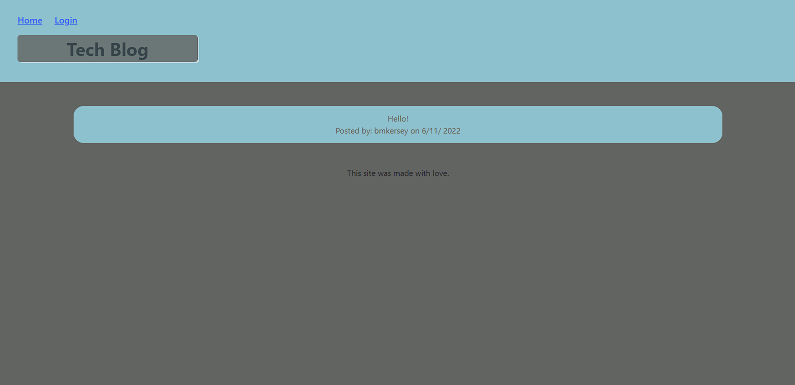

  # Tech-Blog

  

  ## Description

  Full stack web application using express javascript. Mysql for database.

  ## Table of Contents
  * [Installation](#installation)
  * [Usage](#usage)
  * [License](#license)
  * [Contribution](#contribution)
  * [Tests](#tests)
  * [Questions](#questions)
  
  ## Installation

  clone repo and type npm install

  ## Usage

  to start use npm start

  ## License

  This project uses the The MIT License.  
  Please visit [https://opensource.org/licenses/MIT](https://opensource.org/licenses/MIT) to learn more.
  

  ## Contribution

  none
  
  ## Tests 

  no tests 
  
  ## Questions
  Questions? Comments? Concerns? Feel free to reach out!  
  Email: bmkersey@gmail.com  
  GitHub: [bmkersey](https://github.com/bmkersey)

  ## Links
  [TechBlog](https://blooming-wave-15141.herokuapp.com/) 

  ## Screenshots
  
  
  